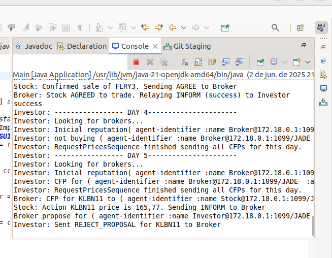
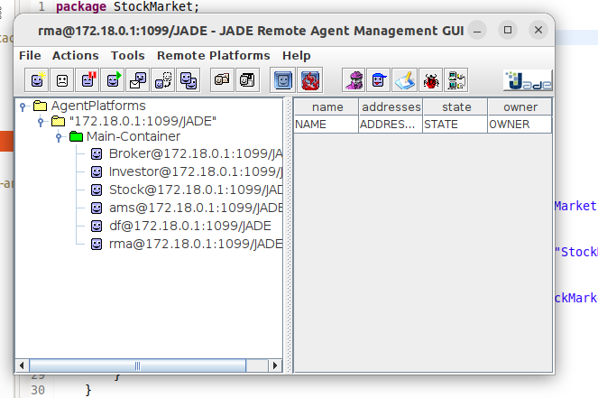
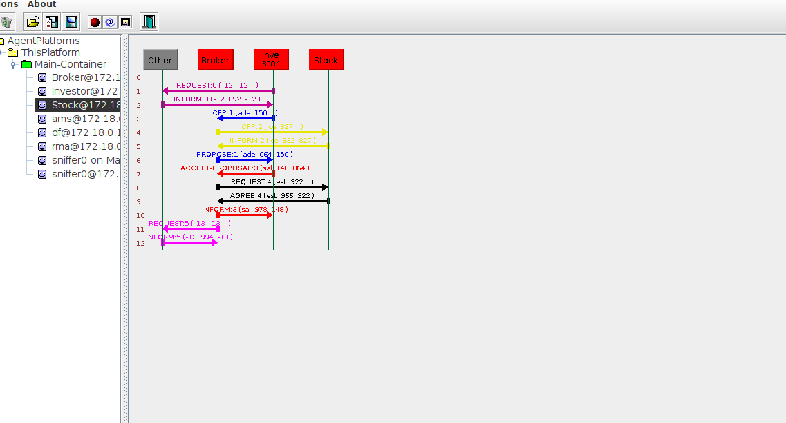

# Reputação com Blockchain

**Disciplina**: FGA0053 - Sistemas Multiagentes <br>
**Nro do Grupo**: 03<br>
**Frente de Pesquisa**:Reputação<br>

## Alunos
|Matrícula | Aluno |
| -- | -- |
| 22/2006884  |  JOSÉ VINICIUS ALVARES SOARES DE QUEIROZ |
| 22/1038248  |  IGOR ALVES DE ABREU |
| 25/1035022 |   CAMILE BARBOSA GONZAGA DE OLIVEIRA |
| 23/1011909  |  GUILHERME NASCIMENTO TEGNOUE |
| 22/1038140  |  VITOR EVANGELISTA DA SILVA ALVES |

## Sobre 
O objetivo do grupo é desenvolver uma simulação inovadora da bolsa de valores brasileira empregando sistemas multiagentes.Cada agente representa um participante do mercado e o comportamento desses agentes é um elemento central do nosso trabalho, eles tomarão decisões de investimento e negociação baseadas em um sistema de reputação. Isso significa que as interações e o desempenho passado de cada agente influenciarão suas estratégias futuras, criando um modelo realista e adaptativo do mercado financeiro.

## Screenshots
### Tela do Console




### Tela do Jade




### Tela do Sniffer





## Instalação 
**Linguagens**: Java<br>
**Tecnologias**: Eclipse, VScode e Jade.<br>
**pré-requisitos**: 
Ter instalado: 
  -  Java Development Kit (JDK)
  -  Framework JADE 
  -  IDE Eclipse (Recomendado)
 

## Uso 

1 - Clonar repositório 
```bash
git clone https://github.com/UnBSMA2025-1/2025.1_G3_SMA_ReputacaoComBlockchain.git
```

2 - Adicionar bibliotecas do jade 

  - Caso seja o Eclipe:
   - a) Botão direito em cima do projeto
   - b) Build Path 
   - c) Add External Archives 
   - d) Selecionar Jade.jar`

3 - Rodar a Main do projeto, ao fazer isso, os agentes serão estanciados e a plataforma Jade aberta.

## Vídeo

[Video de Apresentação Geral](https://youtu.be/kL7w0UY8gmI)

[Video de Apresentação da Blockchain](https://youtu.be/SyaohfRhaF0)

## Participações
|Nome do Membro | Contribuição | Significância da Contribuição para o Projeto (Excelente/Boa/Regular/Ruim/Nula) | Comprobatórios (Branchs)
| -- | ---- | - | -- |
| José  |  Programação dos agentes Broker,Investor e Stock;Configuração dos ambientes e integração geral do projeto | Boa | Main
| Igor  |  Programação do algoritmo de reputação dos agentes e pesquisa bibliográfica necessária ao projeto| Boa | Igor
| Camile  |  Programação de uma branch paralela de auxílio,do agente Banco Central e documentação | Boa | Camile
| Guilherme  |  Programação dos Fatos da Base de Conhecimento Lógica | Boa | devel
| Vitor  |  Programação do algoritmo de blockchain gerenciada por agentes | Boa | Vitor

## Outros 

### Lições Aprendidas
 - Modelagem e aplicação de sistemas multiagentes.
 - Aplicação do paradigma multiagentes com foco em reputação
 - Construção de blockchain
 - Elaboração de pesquisa bibliográfica.

### Percepções
 - Dificuldades em configurar o ambiente foi o principal desafio.

### Contribuições e Fragilidades
 - A equipe no final até que teve desempenho razoável, mas tivemos dificuldade de comunicação no decorrer do projeto.
 
## Trabalhos Futuros 
 - Planejamos otimizar a performance, implementar modelos de comportamento de agentes mais complexos, expandir o modelo de mercado com mais fatores reais edesenvolver uma visualização aprimorada.
 - Planejamos implementar a blockchain com o restante do codigo.

## Fontes
- CORRẼA DA SILVA,André. Guia de instalação JADE(Jade Agente DEvelopment) no sistema operacional Linux.2024.9. Projeto de pesquisa – Universidade 
- INSTITUTO DE CIÊNCIA E TECNOLOGIA (Itália). JADE: Java Agent Development Framework. [S. l.]: Telecom Italia Labs, [s.d.]. Disponível em: http://jade.tilab.com/. Acesso em: 2 jun. 2025.de Brasília, Faculdade do Gama, 2025.
-B3 S.A. – BRASIL, BOLSA, BALCÃO. [S. l.]: B3, [s.d.]. Disponível em: http://www.b3.com.br. Acesso em: 2 jun. 2025.
- LUSSANGE,Johann;LAZAREVICH,Ivan;BOURGEOIS-GIRONDE,Sacha;PALMINTERI,Stefano;GUTKIN,Boris.Modelling stock markets by multi-agent reinforcement learning.Cognitive Neurodynamics,v.15,n.6,p.115-147,2020.

